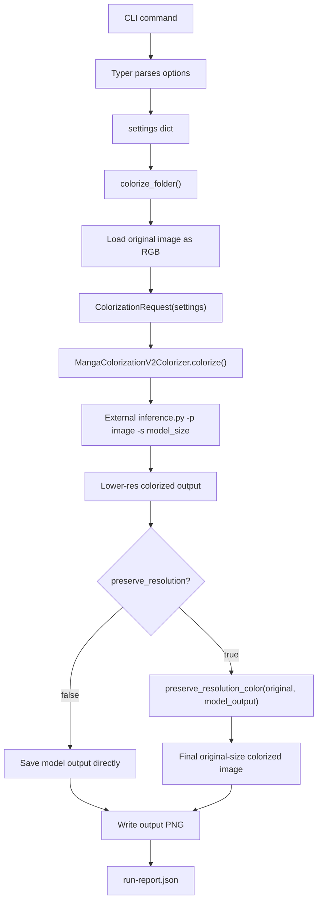

# How `--preserve-resolution` Works

This document explains how the Manga Colorist `--preserve-resolution` option works, why it lives in our wrapper instead of the external `manga-colorization-v2` project, and how it differs from `--model-size`.

It is written for a junior engineer who needs to understand the flow before changing or debugging it.

## Short Version

`--preserve-resolution` is **not** supported by the external `manga-colorization-v2` project.

It is our wrapper's option.

The external model still colorizes a resized version of the page. Then our pipeline takes the model's lower-resolution color output and combines its color information with the original high-resolution manga page.

```text
Original high-res manga page
        |
        | sent to manga-colorization-v2
        v
Lower-res colored model output
        |
        | our code extracts color/chroma from this
        v
Combine model color + original high-res line art
        |
        v
Final high-res readable colored page
```

The important rule:

```text
--model-size is passed to the external model.
--preserve-resolution is not passed to the external model.
```

## Why This Exists

`manga-colorization-v2` internally resizes the page before colorization. With the default model size, the model output can be smaller than the source page.

Example observed during development:

```text
Input page:    1797 x 1312
Model output:  1184 x 864
Old final:     1184 x 864
```

The color looked reasonable, but text, panel borders, and ink lines became harder to read.

With `--preserve-resolution`, the final output becomes:

```text
Input page:    1797 x 1312
Model output:  1184 x 864
New final:     1797 x 1312
```

The model still provides the color. The original page provides the sharp line art.

## The Full Flow



## Where The CLI Options Enter

The CLI options are defined in `src/manga_colorist/cli.py`.

```python
preserve_resolution: Annotated[
    bool,
    typer.Option(
        "--preserve-resolution/--no-preserve-resolution",
        help="Preserve original page dimensions and high-resolution line art.",
    ),
] = True
```

This means `--preserve-resolution` is enabled by default.

These two commands are equivalent:

```bash
manga-colorist colorize --input ./pages --output ./colored
```

```bash
manga-colorist colorize --input ./pages --output ./colored --preserve-resolution
```

To get the old lower-resolution behavior:

```bash
manga-colorist colorize --input ./pages --output ./colored --no-preserve-resolution
```

The CLI stores the option in the `settings` dictionary:

```python
settings = {
    "preserve_resolution": preserve_resolution,
    "model_size": model_size,
}
```

That `settings` dictionary is passed to `colorize_folder()`.

## What Gets Passed To The External Model

The external adapter is implemented in `src/manga_colorist/colorizers/manga_colorization_v2.py`.

The external project supports a size argument:

```bash
python inference.py -p /path/to/page.png -s 576
```

Our wrapper exposes that as:

```bash
--model-size 576
```

Inside the adapter:

```python
model_size = int(request.settings.get("model_size", 576))
command = [self.python, "inference.py", "-p", str(tmp_input), "-s", str(model_size)]
```

So:

```text
our --model-size 576
```

becomes:

```text
external -s 576
```

The external `manga-colorization-v2/inference.py` natively supports this:

```python
parser.add_argument("-s", "--size", type = int, default = 576)
```

## What Does Not Get Passed To The External Model

`--preserve-resolution` is not passed to `manga-colorization-v2`.

This is intentional.

The external project does not have this option. If we tried to run:

```bash
python inference.py -p page.png --preserve-resolution
```

the external script would reject it.

So our adapter passes only the options the external script understands:

```python
command = [self.python, "inference.py", "-p", str(tmp_input), "-s", str(model_size)]
```

Then our own pipeline handles `preserve_resolution` after the external model returns.

## Where Preserve Resolution Happens

The main pipeline is in `src/manga_colorist/pipeline.py`.

The simplified version is:

```python
image = load_normalized_rgb(input_path)
model_output = colorizer.colorize(image, request).convert("RGB")
colorized = preserve_resolution_color(image, model_output) if preserve_resolution else model_output
colorized.save(output_path)
```

So the order is:

1. Load original image.
2. Send original image to the colorizer adapter.
3. Adapter calls external `manga-colorization-v2`.
4. External model returns its colorized output.
5. If `preserve_resolution` is enabled, postprocess the result.
6. Save final PNG.

This keeps the external model unchanged.

## The Core Idea: Luminance vs Chroma

Images can be represented in different color spaces.

Most people know RGB:

```text
R = red
G = green
B = blue
```

For this feature, RGB is not ideal. Instead, the postprocessor uses YCbCr:

```text
Y  = luminance / brightness / grayscale structure
Cb = blue-yellow color information
Cr = red-green color information
```

For manga, this is useful because:

```text
Original page:
- sharp text
- sharp black ink
- sharp panel borders
- original resolution
- no color

Model output:
- useful generated color
- lower resolution
- blurrier text and edges
```

The postprocessor combines them:

```text
Final Y     = original high-resolution luminance
Final Cb/Cr = model-generated color
```

In plain English:

```text
Use the original page for structure.
Use the model output for color.
```

## The Postprocessor

The postprocessor lives in `src/manga_colorist/postprocess.py`.

The public function is:

```python
preserve_resolution_color(original, colorized)
```

Conceptually:

```python
original_rgb = original.convert("RGB")
color_rgb = colorized.convert("RGB")

if color_rgb.size != original_rgb.size:
    color_rgb = color_rgb.resize(original_rgb.size, Image.Resampling.LANCZOS)

original_y, _, _ = original_rgb.convert("YCbCr").split()
_, color_cb, color_cr = color_rgb.convert("YCbCr").split()

return Image.merge("YCbCr", (original_y, color_cb, color_cr)).convert("RGB")
```

The actual implementation also protects ink and paper areas.

## Why We Resize The Model Output

The model output may be smaller than the original page.

Example:

```text
Original: 1797 x 1312
Model:    1184 x 864
```

The Y, Cb, and Cr channels must have the same dimensions before they can be merged.

So the color output is resized to the original size:

```python
if color_rgb.size != original_rgb.size:
    color_rgb = color_rgb.resize(original_rgb.size, Image.Resampling.LANCZOS)
```

Important: we are not simply upscaling the final RGB image and saving it.

Bad approach:

```text
lower-res RGB output -> upscale -> save
```

That keeps blurry text.

Our approach:

```text
lower-res RGB output -> upscale color channels only
original high-res page -> keep luminance
merge original luminance + model color -> save
```

That keeps text and ink sharper.

## Ink Protection

If we blindly apply model chroma everywhere, black text can get colored halos.

Example:

```text
Original text:
black

Model color near text:
slightly red, green, or blue because the model output is blurry

Naive recomposition:
black text gets colored edges
```

To avoid that, the postprocessor detects very dark pixels from the original page:

```python
dark_mask = y_array <= ink_threshold
```

Default:

```python
ink_threshold = 40
```

For those pixels, chroma is neutralized:

```python
cb_array[dark_mask] = 128.0
cr_array[dark_mask] = 128.0
```

In YCbCr, neutral chroma is around `128`.

That means dark ink stays black or gray, not tinted red, blue, or green.

## Paper Protection

Speech bubbles and white page areas can also get unwanted tint.

Example:

```text
Original speech bubble:
white

Model output:
slightly yellow or green because color bleeds from nearby regions

Naive recomposition:
speech bubble becomes tinted
```

So the postprocessor detects near-white pixels:

```python
paper_mask = y_array >= paper_threshold
```

Default:

```python
paper_threshold = 244
```

Then it pulls chroma partially back toward neutral:

```python
paper_chroma_strength = 0.35
```

This reduces strong unwanted tinting in white areas while still allowing some color where the model intentionally added it.

## What Happens With `--no-preserve-resolution`

If the user runs:

```bash
manga-colorist colorize \
  --input ./pages \
  --output ./colored \
  --device cpu \
  --overwrite \
  --no-preserve-resolution
```

then the pipeline skips `preserve_resolution_color()`:

```python
colorized = model_output
```

The saved file is exactly what `manga-colorization-v2` produced.

That means the output may be lower resolution.

This is useful for debugging or comparing the old and new behavior.

## Run Report Metadata

Each result in `run-report.json` records size information:

```json
{
  "details": {
    "original_size": [1797, 1312],
    "model_output_size": [1184, 864],
    "final_size": [1797, 1312],
    "model_size": 576,
    "preserve_resolution": true
  }
}
```

This helps answer questions like:

```text
Was preserve-resolution enabled?
What did the external model output?
Did the final output match the source dimensions?
What model size was used?
```

## Concrete Command Example

```bash
MANGA_COLORIZATION_V2_PATH="$PWD/.external/manga-colorization-v2" \
MANGA_COLORIZATION_V2_PYTHON="$PWD/.external/manga-colorization-v2/.venv/bin/python" \
PYTHONPATH=src \
.venv/bin/manga-colorist colorize \
  --input ./pages \
  --output ./colored-new \
  --device cpu \
  --overwrite \
  --preserve-resolution
```

Internally:

```text
CLI:
  preserve_resolution = true
  model_size = 576

Pipeline:
  loads pages/01-2.png
  original size = 1797 x 1312

Adapter:
  calls python inference.py -p /tmp/01-2.png -s 576

External model:
  returns lower-res colorized image
  model output size = 1184 x 864

Postprocessor:
  takes original Y channel at 1797 x 1312
  takes model Cb/Cr channels resized to 1797 x 1312
  protects ink and paper areas

Final output:
  colored-new/01-2.png
  final size = 1797 x 1312
```

## Why Not Just Increase `--model-size`

Increasing `--model-size` can help, but it is not the same fix.

Tradeoffs:

```text
larger model size = slower
larger model size = more memory
larger model size = may still not equal original size
larger model size = may change model behavior
```

The original page already has excellent line art and text.

So the best approach is:

```text
Use the model for color.
Use the original page for structure.
```

That is what `--preserve-resolution` does.

## File Responsibilities

### `src/manga_colorist/cli.py`

Defines user-facing options:

```text
--preserve-resolution / --no-preserve-resolution
--model-size
```

Builds the `settings` dictionary passed into the pipeline.

### `src/manga_colorist/pipeline.py`

Owns the full workflow:

```text
load image
call colorizer
optionally postprocess
save output
write report
```

This is where `preserve_resolution` is actually used.

### `src/manga_colorist/colorizers/manga_colorization_v2.py`

Owns the external model subprocess call.

It passes only supported external options:

```text
python inference.py -p <tmp_input> -s <model_size>
```

It does not pass `--preserve-resolution`.

### `src/manga_colorist/postprocess.py`

Owns the high-resolution recomposition:

```text
original luminance + model chroma = final high-res color page
```

## Final Summary

Remember this distinction:

```text
--model-size is for the external model.
--preserve-resolution is for our wrapper after the model finishes.
```

Or shorter:

```text
manga-colorization-v2 provides color.
Our preserve-resolution code restores readability.
```

